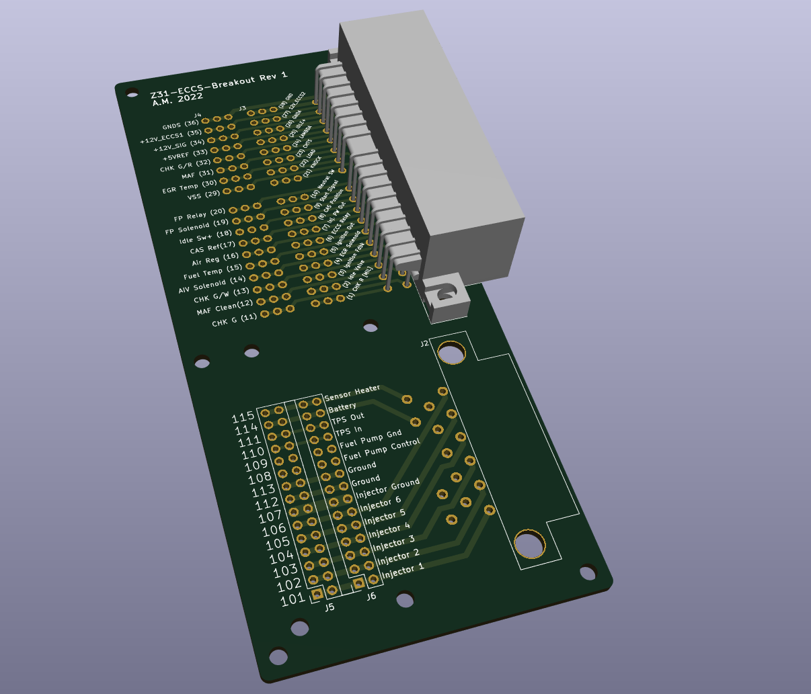
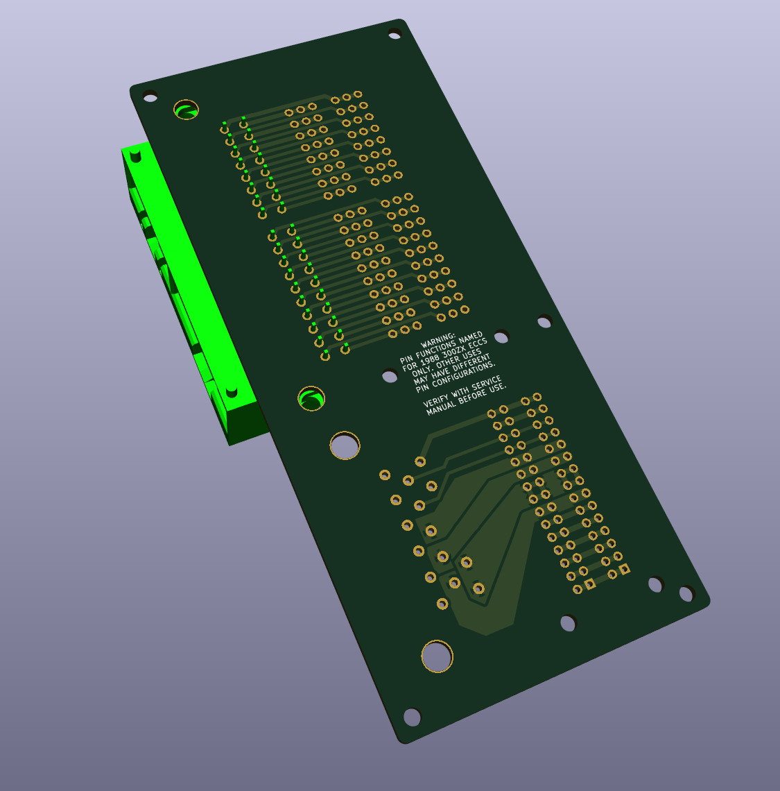

#Z31-ECU-Breakout

This repository contains KiCad files for a breakout board usable for the 1980s Nissan ECCS with the 36(20+16)+15 pin harness.

I used this to run an M30 ECU without chopping up my existing harness prior to fabricating a new 76-pin harness.

You will need a the 36-pin Dual-Line Interlock (DLI) header (AMP P/N 172023-1) and yet unidentified 15-pin header (looks kinda like a JPT/MCP part, marked for Mitsubishi Electric (SJB) but not in any English catalogs), and fasteners for both. The 15-pin header will need to be desoldered from a scrapped ECU; the 36-pin is available from Digikey/Mouser/etc. as of 2025.

